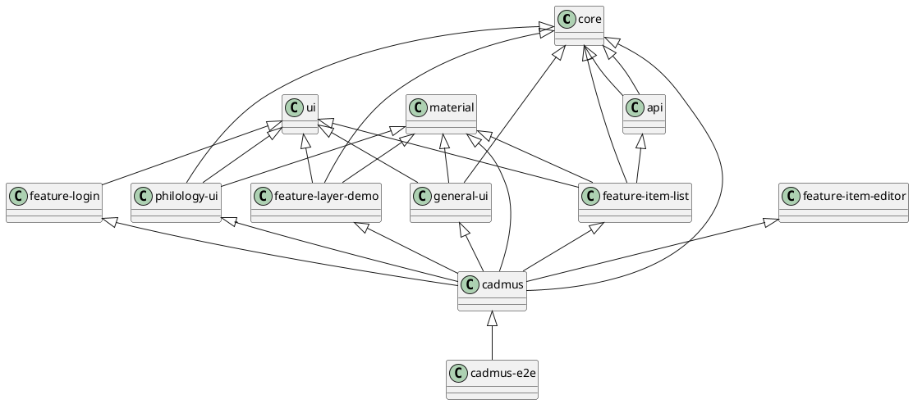

# Cadmus

This project was generated using [Nx](https://nx.dev).

1. `npx create-nx-workspace@latest cadmus`.
2. `nx migrate @nrwl/workspace` to eventually upgrade nrwl.
3. `ng update` if some packages are still outdated.

View dependencies: `nx dep-graph`.

## Architecture

### Organization

The planned architecture is:

- `apps/cadmus`: the frontend app.
- `libs/core`: core services and models.
- `libs/features`: app's features libraries, one for each page.
  - `<partgroup-feature>`: the pages for all the parts belonging to the specified group to be included in the app.
- `libs/material`: Angular material.
- `libs/parts`: Cadmus parts libraries, one for each group of parts. These only include models and dumb components.
  - `<partgroup>-ui`: core services and models plus dumb UI components for the part. E.g. `libs/parts/general-ui`.
- `libs/ui`: shared dumb UI components.

To include the part UI in your app, add a corresponding library for its page under `features`, where you will include the part's state and wrap its dumb editor component into the page.



### Routes

- `/items`: list of items.
- `/items/<id>`: single item editor. This allows editing the item's metadata, and shows a list of its parts, where you can add or remove parts. Item's `id` is equal to `new` for a new item.
- `/items/<id>/<part-typeid>/<part-id>?roleId=<role-id>`: single part editor. Role ID is optional, and can be `default` for a null role.

### Adding Parts

To **add a new parts library**:

- create a new Nrwl Angular library named `<partgroup>-ui` under `parts/<partgroup>` (use simple module name in generator). For instance, for general purpose parts I created `parts/general/general-ui`.

To **add a new part**:

1. add the part *model* (derived from `Part`), its type ID constant, and its JSON schema constant to `models.ts`. For instance:

```ts
import { Part } from '@cadmus/core';

/**
 * Note part.
 */
export interface NotePart extends Part {
  text: string;
  tag: string;
}

/**
 * The type ID used to identify the NotePart type.
 */
export const NOTE_PART_TYPEID = 'net.fusisoft.note';

/**
 * JSON schema for the note part. This is used in the editor demo.
 * You can use the JSON schema tool at https://jsonschema.net/.
 */
export const NOTE_PART_SCHEMA = {
  $schema: 'http://json-schema.org/draft-07/schema#',
  $id: 'www.fusisoft.net/cadmus/parts/general/note.json',
  type: 'object',
  title: 'NotePart',
  required: ['id', 'itemId', 'text', 'timeModified', 'typeId', 'userId'],
  properties: {
    // ... etc ...
  }
};
```

2. add a *part editor dumb component* named after the part (e.g. `NotePartComponent` after `NotePart`), and extending `PartEditorBaseComponent<T>` where `T` is the part's type.

3. add a *part editor demo dumb component* named after the part (e.g. `NotePartComponentDemo` after `NotePart`). This will essentially be a wrapper of two distinct controls: the part's editor component, and a `JsonEditorResourcesComponent`. These components are mutually connected, so that you can edit the JSON code for the part (and eventually for its thesauri sets) and set the visual editor to it, or vice-versa.

### Part Editors

Part editors are dumb UI components extending `PartEditorBaseComponent<T>`, where `T` is the part's type.

The base component is not an abstract class (this is best for Angular), and provides this API:

**Input**:

- `disabled` (type `boolean`): true to disable the control as a whole.
- `json` (type `string`): the JSON code representing the part being edited. The corresponding output is implemented via the `jsonChange` event.
- `thesauri` (type `{ [key: string]: Thesaurus } | null`): optional thesauri sets to be consumed by the editor. Each thesaurus is keyed under an ID which is meaningful and unique only within the context of the editor.

**Output**:

- `jsonChange` (type `string`): fired when the user saves the form with valid data.
- `editorDirty` (type `boolean`): fired whenever the dirty status of the form changes. This is used to let this status bubble up to the container component page, which should eventually warn before navigating away from it.
- `editorClose` (no argument): fired when the editor is closed without saving, by user request.

**Helpers**:

- `subscribeToFormStatus`: used to subscribe to the status change of the specified form (usually the root form of the editor), so that whenever its dirty status changes, an `editorDirty` event is fired.
- `getPartFromJson(json: string = null): T`: get the part from the specified JSON code, or from the current json property if no JSON code is specified. This is just a helper method for parsing JSON (when truthy) and casting it to the template argument type.
- `updateJson(json: string)`: update the `json` property from the specified code, without triggering a call to `onPartSet`.
- `onPartSet`: invoked whenever the json property is set, unless setting it via `updateJson`. The default implementation does nothing. Override to add custom behavior, e.g. update the form to reflect the new part value.
- `onThesauriSet`: invoked whenever the thesauri property is set.

A typical editor extending this base can follow these guidelines:

- add form controls and eventually thesaurus entries properties (`ThesaurusEntry[]`) to be consumed by the template. If thesaurus entries are required, set these properties in `onThesauriSet`.
- when initializing, call `subscribeToFormStatus` passing it the root form, so that the control can automatically bubble its dirty status.
- add an `updateForm(part)` method to update the form controls from the part's model, calling it from `onPartSet`.
- add a `getPartFromForm` method to get a part object from the form controls. Among the common part's properties, only `typeId` gets set at this level; the other properties will be set by the page wrapping the editor.
- add a `close` method for closing without saving (prompting when dirty).
- add a `save` method which if the form is valid uses `getPartFromForm` to get the part, and `updateJson` to update the JSON code stringified from that part.
- template: `form` including a `fieldset` (to use the `disabled` attribute), including a `mat-card`. Header and footer in the card should be standardized, while the content is free.

### Part Editors Demos

Each part editor usually is provided with a corresponding demo component, which allows users to play with the editor by passing JSON data to it, or getting JSON data from it.

The demo component is built of two distinct controls:

- a general purpose `JsonEditorResourcesComponent`: JSON editors for part and eventually thesauri sets. This represents the _code_ editor.
- a specific part editor component. This represents the _visual_ editor.

In the code editor, you should enter the part's JSON code, and eventually one or more thesauri.

The part's code must be valid according to its schema (the JSON schema specified in the models). For instance, a `NotePart` might appear as:

```json
{
    "itemId": "4a26ad5c-0a82-4a21-b1d7-15cddbb1bfd1",
    "id": "1bf411d8-54ad-4f4c-bde6-2fc78226ebd5",
    "typeId": "net.fusisoft.note",
    "roleId": "",
    "tag": "some-tag",
    "text": "This is a **sample** text.",
    "timeModified": "2019-11-29T16:48:49.694Z",
    "userId": "zeus"
}
```

The thesauri code is like in this sample (for the `NotePart` tags):

```json
{
  "tags": {
    "id": "colors",
    "language": "ita",
    "entries": [
      { "id": "red", "value": "rosso" },
      { "id": "green", "value": "verde" },
      { "id": "blue", "value": "blu" }
    ]
  }
}
```

As you can see, each thesaurus is keyed under a unique property name, like `tags` here. In the case of `NotePart`, if a thesaurus is found under the `tags` key, its entries are used to feed a closed list of tags. If no such thesaurus is found, then the tag is just an open value.

## Quick Start & Documentation

[Nx Documentation](https://nx.dev/angular)

[10-minute video showing all Nx features](https://nx.dev/angular/getting-started/what-is-nx)

[Interactive Tutorial](https://nx.dev/angular/tutorial/01-create-application)

## Documentation with Compodoc

- <https://compodoc.app/>

Ensure that you have installed compodoc globally: `npm install -g @compodoc/compodoc`.

Generate the documentation for each project like this: `compodoc -p apps/demo/src/tsconfig.app.json -s`.

## Adding capabilities to your workspace

Nx supports many plugins which add capabilities for developing different types of applications and different tools.

These capabilities include generating applications, libraries, etc as well as the devtools to test, and build projects as well.

Below are some plugins which you can add to your workspace:

- [Angular](https://angular.io)
  - `ng add @nrwl/angular`
- [React](https://reactjs.org)
  - `ng add @nrwl/react`
- Web (no framework frontends)
  - `ng add @nrwl/web`
- [Nest](https://nestjs.com)
  - `ng add @nrwl/nest`
- [Express](https://expressjs.com)
  - `ng add @nrwl/express`
- [Node](https://nodejs.org)
  - `ng add @nrwl/node`

## Generate an application

Run `ng g @nrwl/angular:app my-app` to generate an application.

> You can use any of the plugins above to generate applications as well.

When using Nx, you can create multiple applications and libraries in the same workspace.

## Generate a library

Run `ng g @nrwl/angular:lib my-lib` to generate a library.

> You can also use any of the plugins above to generate libraries as well.

Libraries are sharable across libraries and applications. They can be imported from `@cadmus/mylib`.

## Development server

Run `ng serve my-app` for a dev server. Navigate to http://localhost:4200/. The app will automatically reload if you change any of the source files.

## Code scaffolding

Run `ng g component my-component --project=my-app` to generate a new component.

## Build

Run `ng build my-app` to build the project. The build artifacts will be stored in the `dist/` directory. Use the `--prod` flag for a production build.

## Running unit tests

Run `ng test my-app` to execute the unit tests via [Jest](https://jestjs.io).

Run `nx affected:test` to execute the unit tests affected by a change.

## Running end-to-end tests

Run `ng e2e my-app` to execute the end-to-end tests via [Cypress](https://www.cypress.io).

Run `nx affected:e2e` to execute the end-to-end tests affected by a change.

## Understand your workspace

Run `nx dep-graph` to see a diagram of the dependencies of your projects.

## Further help

Visit the [Nx Documentation](https://nx.dev/angular) to learn more.
