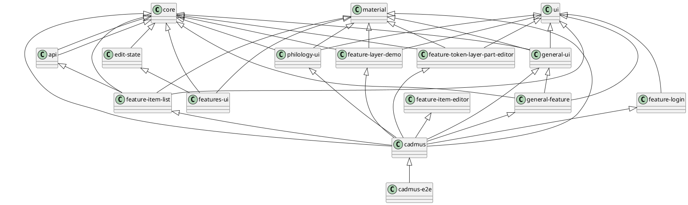

# Cadmus

This project was generated using [Nx](https://nx.dev).

1. `npx create-nx-workspace@latest cadmus`.
2. `nx migrate @nrwl/workspace` to eventually upgrade nrwl.
3. `ng update` if some packages are still outdated.

View dependencies: `nx dep-graph`.

## Architecture

### Organization

The general multirepo architecture is structured into these sections:

- `apps/cadmus`: the frontend app.
- `libs/core`: core services and models.
- `libs/features`: app's features libraries:
  - `libs/feature-...`: a feature library for each page.
  - `libs/features-ui`: components shared among features.
- `libs/material`: Angular material.
- `libs/parts`: Cadmus parts libraries:
  - `<partgroup>/<partgroup>-ui`: core services and models plus dumb UI components for parts and fragments in a specific group. E.g. `libs/parts/general/general-ui`.
  - `<partgroup>/<partgroup>-feature`: feature pages for parts and fragments in a specific group. E.g. `libs/parts/general/general-feature`.
- `libs/ui`: shared dumb UI components.



### Routes

- `/items`: list of items.

- `/items/<id>`: single item editor. This allows editing the item's metadata, and shows a list of its parts, where you can add or remove parts. Item's `id` is equal to `new` for a new item.

- `/items/<id>/<part-group>/<part-typeid>/<part-id>?rid=<role-id>`: single part editor. Role ID is optional.

- `/items/<id>/layer/token/<part-id>?rid=<role-id>`: single part's token-based text layer editor. Role ID is optional and can be used to pre-select a layer.

- `/items/<id>/<part-group>/fragment/<part-id>/<fr-typeid>/<loc>?rid=<role-id>`: single part's fragment editor. Role ID is optional.

Note that the part-editing routes always have a part-group key. This comes from the `editorKey` property of each part's definition; if such a property is not defined (but in practice this should never happen), it defaults to `default`.

Grouping parts is required as far as we want to be able to lazily load our part-related modules. For instance, all our generic parts will be under the same `generic` group key, and their code will be found in the corresponding, lazy-loaded module. When editing an item's part, the frontend looks at the part definitions, searching for the first one matching the part's type ID; then, it uses the corresponding part's group key to build the edit URL.

Routes to part/fragment editors are built by a specialized service, `LibraryRouteService`. The routes to feature editors are defined in the respective lazily-loaded modules.

Routes **examples**:

1. a **part** route without role:

- `/items/`
- `41d5208b-1af7-44a1-b690-33f85c7d24fa/`: item's ID.
- `general/`: group key.
- `net.fusisoft.note/`: part's type ID.
- `eafc9d63-f790-4c96-8107-294f4cb1a952`: part's ID.

Here the group key follows the route to the lazily loaded module with the part editor, while the part's type ID tells which editor should be used from that module.

2. a **part** route with **role**: this is the same as #1, except for the final `rid` query parameter.

- `/items/`
- `41d5208b-1af7-44a1-b690-33f85c7d24fa/`: item's ID.
- `general/`: group key.
- `net.fusisoft.note/`: part's type ID.
- `eafc9d63-f790-4c96-8107-294f4cb1a952`: part's ID.
- `?rid=scholarly`: part's role ID. This distinguishes a scholarly note, as opposed to a general purpose note (this sample is limited to the note part for clarity; but in the case of a note you would not require a role, as the note part has a `tag` property right for the purpose of grouping notes into different sets).

Here the role ID is ignored as for determining the target page, as the part's editor is always the same, whatever its role. Yet, the role information must be retained in order to properly save the part.

3. a **text layer part** route:

- `/items/`
- `41d5208b-1af7-44a1-b690-33f85c7d24fa/`: item's ID.
- `layer/`
- `token/`
- `eafc9d63-f790-4c96-8107-294f4cb1a952`: part's ID.

The part layers editor is always the same, whatever the layers types. Thus, its route does not require a group key for identifying the module, or a part type ID for identifying the editor. It just reflects the fact that we are editing a `layer`, and that the layer's location rests on `token`-based coordinates. This is currently the only type of text layer possible, but we could provide more in the future. In this case, they will require a different part layers editor, whose route will replace `token` with something else.

4. a **text layer part** route with **role**: this is the same as #3, except for the final `rid` query parameter. This is used to pre-select a specific layer in the layers editor.

- `/items/`
- `41d5208b-1af7-44a1-b690-33f85c7d24fa/`: item's ID.
- `layer/`
- `token/`
- `eafc9d63-f790-4c96-8107-294f4cb1a952`: part's ID.
- `?rid=fr.net.fusisoft.comment`: select the comments layer in the editor.

5. a **text layer fragment** route:

- `/items/`
- `41d5208b-1af7-44a1-b690-33f85c7d24fa/`: item's ID.
- `general/`: group key.
- `fragment/`
- `eafc9d63-f790-4c96-8107-294f4cb1a952/`: part's ID.
- `fr.net.fusisoft.comment`: fragment's type ID. This is equal to the part's role ID, stripping an eventual layer's role ID out.
- `2.1`: the fragment's location.

6. a **text layer fragment** route with layer **role**:

- `/items/`
- `41d5208b-1af7-44a1-b690-33f85c7d24fa/`: item's ID.
- `general/`: group key.
- `fragment/`
- `eafc9d63-f790-4c96-8107-294f4cb1a952/`: part's ID.
- `fr.net.fusisoft.comment`: fragment's type ID. This is equal to the part's role ID, stripping an eventual layer's role ID out.
- `2.1`: the fragment's location.
- `?rid=scholarly`: the layer's role. This is the optional suffix appended to the text layer part's role after a colon. For instance, the part's role might be `fr.net.fusisoft.comment:scholarly`; in this case, the fragment type ID is `fr.net.fusisoft.comment`, and the layer role ID is `scholarly`.

### Adding Parts

To **add a new parts library**:

- create a new Nrwl Angular library named `<partgroup>-ui` under `parts/<partgroup>` (use simple module name in generator). For instance, for general purpose parts I created `parts/general/general-ui`. This will host dumb components for editing and their demo counterparts.
- create a new Nrwl Angular library named `<partgroup>-feature` under `parts/<partgroup>` (use simple module name in generator). For instance, for general purpose parts I created `parts/general/general-feature`. This will host the pages (features) for each part. Every page wraps the dumb UI component into a component which has a corresponding Akita's state, and gets its data pushed via observables. Also, each page has a route (see above).

To **add a new part**:

a) in a `<partgroup>-ui` module:

1. add the part *model* (derived from `Part`), its type ID constant, and its JSON schema constant to `<part>.ts` (e.g. `note-part.ts`). For instance:

```ts
import { Part } from '@cadmus/core';

/**
 * Note part.
 */
export interface NotePart extends Part {
  text: string;
  tag: string;
}

/**
 * The type ID used to identify the NotePart type.
 */
export const NOTE_PART_TYPEID = 'net.fusisoft.note';

/**
 * JSON schema for the note part. This is used in the editor demo.
 * You can use the JSON schema tool at https://jsonschema.net/.
 */
export const NOTE_PART_SCHEMA = {
  $schema: 'http://json-schema.org/draft-07/schema#',
  $id: 'www.fusisoft.net/cadmus/parts/general/note.json',
  type: 'object',
  title: 'NotePart',
  required: ['id', 'itemId', 'text', 'timeModified', 'typeId', 'userId'],
  properties: {
    // ... etc ...
  }
};
```

2. add a *part editor dumb component* named after the part (e.g. `NotePartComponent` after `NotePart`), and extending `ModelEditorComponentBase<T>` where `T` is the part's type.

3. add a *part editor demo dumb component* named after the part (e.g. `NotePartComponentDemo` after `NotePart`). This will essentially be a wrapper of two distinct controls: the part's editor component, and a `JsonEditorResourcesComponent`. These components are mutually connected, so that you can edit the JSON code for the part (and eventually for its thesauri sets) and set the visual editor to it, or vice-versa.

b) in a `<partgroup>-feature` module:

4. add a *part editor feature component* named after the part (e.g. `NotePartFeatureComponent` after `NotePart`), with routing. Each editor has its component, and its state management artifacts under the same folder (store, query, and service).

### Editor Components

The general architecture of part/fragments editing, from bottom to top, is as follows:

1. `<X>PartComponent` or `<X>FragmentComponent` (in a `<partgroup>-ui` module): at the bottom level, we have a dumb UI component for part/fragment X, extending `ModelEditorComponentBase<T>`.

2. `<X>PartDemoComponent` or `<X>FragmentDemoComponent` (in the same `<partgroup>-ui` module): a container for a JSON code editor and the editor dumb component at (1), used for demo purposes.

3. `<X>PartFeatureComponent` (in a `<partgroup>-feature` module): the dumb UI component for part X is wrapped into a feature UI component.

#### Editor Components - 1. Dumb Editor

The open-ended portion of the UI is represented by part and fragment editors. At the bottom level, both are dumb UI components extending `ModelEditorComponentBase<T>`, where `T` is the model's type (=the type of the part or fragment).

The base class provides this API:

**Input**:

- `disabled` (type `boolean`): whether the editor is disabled. When changed, the "root" form of the editor is disabled or enabled accordingly.
- `json` (type `string`): the JSON code representing the model being edited. The corresponding output is implemented via the `jsonChange` event.
- `thesauri` (type `ThesauriSet | null`): optional thesauri sets to be consumed by the editor. Each thesaurus is keyed under its own ID.
- `dirty$` (type `Observable<boolean>`): bound to an observable which tells whether the edited model is dirty, i.e. its data were edited locally, but not saved to the server.

**Output**:

- `jsonChange` (type `string`): fired when the user saves the form with valid data.
- `editorClose` (no argument): fired when the user requests the editor to close.

**Helpers**:

- `form: FormGroup`: the "root" form of the editor. You must instantiate this in your derived editor constructor.
- `getModelFromJson(json: string = null): T`: get the model from the specified JSON code, or from the current json property if no JSON code is specified. This is just a helper method for parsing JSON (when truthy) and casting it to the template argument type.
- `updateJson(json: string)`: update the `json` property from the specified code, without triggering a call to `onModelSet`.
- `onModelSet`: invoked whenever the json property is set, unless setting it via `updateJson`. The default implementation does nothing. Override to add custom behavior, e.g. update the form to reflect the new part value.
- `onThesauriSet`: invoked whenever the thesauri property is set.
- `close()`: emit the close editor event.
- `save()`: if the root form is valid, get the model from its controls, serialize it into JSON and emit the JSON change event, marking the root form as pristine.

Also, the base class implements `ComponentCanDeactivate`, which is used by pending changes guards to decide if the user should be prompted when leaving the editor. This relies on the `dirty$` input property, and on the root form's dirty state: both must be false for the guard to allow exiting the editor without prompting.

A typical editor extending this base can follow these guidelines:

- add your form controls, and eventually thesaurus properties to be consumed by the template. When thesaurus properties are required, set them in `onThesauriSet`.
- add an `updateForm(model)` method to update the form controls from the part's model, calling it from `onModelSet`.
- add a `getModelFromForm` method to get a model object from the form controls. Among the common part's properties, only `typeId` gets set at this level; the other properties will be set by the page wrapping the editor.
- *template*: `form`, including a `mat-card`. Header and footer in the card should be standardized, while the content is free.

#### Editor Components - 2. Editor Demo

Each part editor usually is provided with a corresponding demo component, which allows users to play with the editor by passing JSON data to it, or getting JSON data from it.

The demo component is built of two distinct controls:

- a general purpose `JsonEditorResourcesComponent`: JSON editors for model and eventually thesauri sets. This represents the *code* editor.
- a specific part editor component. This represents the *visual* editor.

In the code editor, you should enter the model's JSON code, and eventually one or more thesauri.

The model's code must be valid according to its schema (the JSON schema specified in the models). For instance, a `NotePart` might appear as:

```json
{
    "itemId": "4a26ad5c-0a82-4a21-b1d7-15cddbb1bfd1",
    "id": "1bf411d8-54ad-4f4c-bde6-2fc78226ebd5",
    "typeId": "net.fusisoft.note",
    "roleId": "",
    "tag": "some-tag",
    "text": "This is a **sample** text.",
    "timeModified": "2019-11-29T16:48:49.694Z",
    "userId": "zeus"
}
```

The thesauri code is like in this sample (for the `NotePart` tags):

```json
{
  "note-tags": {
    "id": "colors",
    "language": "ita",
    "entries": [
      { "id": "red", "value": "rosso" },
      { "id": "green", "value": "verde" },
      { "id": "blue", "value": "blu" }
    ]
  }
}
```

If no thesaurus with the specified is found, then the tag is just an open value.

#### Editor Components - 3. Feature Editor

The feature editor is a wrapper around the dumb editor. It has an Angular route, and depends on two *Akita* components:

- an X-part/fragment *query*, used to read data from the store;
- an X-part/fragment *service*, used to write data to the store, and to load its state when the component is initialized. In Akita, components should never interact with stores directly; such services act as facades, and couple the store with an API service).

Usually, the service extends `EditPartServiceBase` (for parts) or `EditFragmentServiceBase`, which provide load/save methods and a dirty state setter. The component binds a number of observable properties to the query, and its template is fed from these observables. When the store gets updated (via the service), the observables change, and this is reflected in the reactive UI.

When the user saves in an editor dumb component, the `jsonChange` event is emitted, and the form is set to pristine state.

In turn, the editor feature component handles the `jsonChange` event by invoking its service's `save` method with the JSON code representing the part to be saved.

The `save` method (implemented in the base service) sets the "saving" and "dirty" states to true, and invokes the API save method:

- if the API succeeds, the "saving" and "dirty" states are set to "false".
- if the API fails, the "saving" state is set to false (while "dirty" remains true).

## Quick Start & Documentation

[Nx Documentation](https://nx.dev/angular)

[10-minute video showing all Nx features](https://nx.dev/angular/getting-started/what-is-nx)

[Interactive Tutorial](https://nx.dev/angular/tutorial/01-create-application)

## Documentation with Compodoc

- <https://compodoc.app/>

Ensure that you have installed compodoc globally: `npm install -g @compodoc/compodoc`.

Generate the documentation for each project like this: `compodoc -p apps/demo/src/tsconfig.app.json -s`.

## Adding capabilities to your workspace

Nx supports many plugins which add capabilities for developing different types of applications and different tools.

These capabilities include generating applications, libraries, etc as well as the devtools to test, and build projects as well.

Below are some plugins which you can add to your workspace:

- [Angular](https://angular.io)
  - `ng add @nrwl/angular`
- [React](https://reactjs.org)
  - `ng add @nrwl/react`
- Web (no framework frontends)
  - `ng add @nrwl/web`
- [Nest](https://nestjs.com)
  - `ng add @nrwl/nest`
- [Express](https://expressjs.com)
  - `ng add @nrwl/express`
- [Node](https://nodejs.org)
  - `ng add @nrwl/node`

## Generate an application

Run `ng g @nrwl/angular:app my-app` to generate an application.

> You can use any of the plugins above to generate applications as well.

When using Nx, you can create multiple applications and libraries in the same workspace.

## Generate a library

Run `ng g @nrwl/angular:lib my-lib` to generate a library.

> You can also use any of the plugins above to generate libraries as well.

Libraries are sharable across libraries and applications. They can be imported from `@cadmus/mylib`.

## Development server

Run `ng serve my-app` for a dev server. Navigate to <http://localhost:4200/>. The app will automatically reload if you change any of the source files.

## Code scaffolding

Run `ng g component my-component --project=my-app` to generate a new component.

## Build

Run `ng build my-app` to build the project. The build artifacts will be stored in the `dist/` directory. Use the `--prod` flag for a production build.

## Running unit tests

Run `ng test my-app` to execute the unit tests via [Jest](https://jestjs.io).

Run `nx affected:test` to execute the unit tests affected by a change.

## Running end-to-end tests

Run `ng e2e my-app` to execute the end-to-end tests via [Cypress](https://www.cypress.io).

Run `nx affected:e2e` to execute the end-to-end tests affected by a change.

## Understand your workspace

Run `nx dep-graph` to see a diagram of the dependencies of your projects.

## Further help

Visit the [Nx Documentation](https://nx.dev/angular) to learn more.
