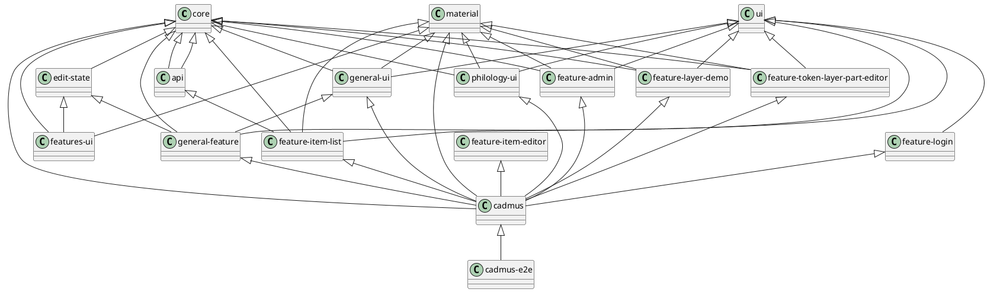

# Architecture

The general multirepo architecture is structured into these sections:

- `apps/cadmus`: the frontend app.
- `libs/core`: core services and models.
- `libs/features`: app's features libraries:
  - `libs/feature-admin`: admin section pages.
  - `libs/feature-...`: a feature library for each page.
  - `libs/features-ui`: components shared among features.
- `libs/material`: Angular material.
- `libs/parts`: Cadmus parts libraries:
  - `<partgroup>/<partgroup>-ui`: core services and models plus dumb UI components for parts and fragments in a specific group. E.g. `libs/parts/general/general-ui`.
  - `<partgroup>/<partgroup>-feature`: feature pages for parts and fragments in a specific group. E.g. `libs/parts/general/general-feature`.
- `libs/ui`: shared dumb UI components.

TODO: complete the graph below

