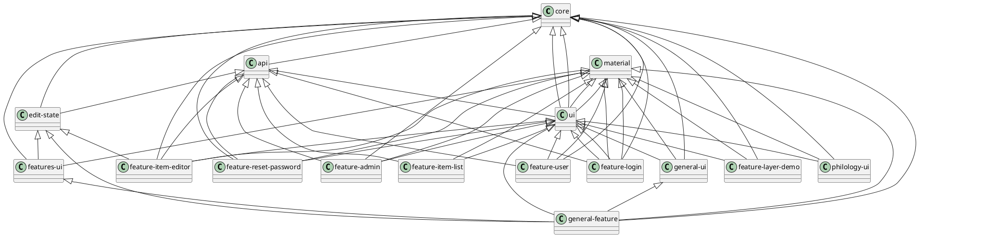

# Architecture

The general monorepo architecture is structured into the following sections.

## Application

- `apps/cadmus`: the frontend app. Presently for development purposes this app imports all the parts in the workspace, and adds their demos to a dedicated menu.

## Core Libraries

- `libs/core`: core services and models.
- `libs/api`: the API services. Dependencies: `core`.
- `libs/material`: Angular Material library. This just provides selected Angular Material modules to its consumer.
- `libs/ui`: general purpose, shared UI dumb components. Dependencies: `core`, `api`, `material`.

## Modular Libraries

- `libs/features`: this folder contains app's features libraries:
  - `libs/features/edit-state`: core components for editor state management. Dependencies: `core`, `api`.
  - `libs/features/feature-login`: login page. Dependencies: `material`, `ui`.
  - `libs/features/feature-user`: user pages: user home, change password. Dependencies: `core`, `material`, `api`, `ui`.
  - `libs/features/feature-reset-password`: reset password page. Dependencies: `core`, `material`, `api`, `ui`.
  - `libs/features/feature-item-list`: list of items page. Dependencies: `api`, `material`, `ui`.
  - `libs/features/feature-item-editor`: item editor page. Dependencies: `core`, `material`, `api`, `ui`, `edit-state`.
  - `libs/features/feature-admin`: admin section pages: admin home, user registration, users manager. Dependencies: `core`, `material`, `api`, `ui`.
  - `libs/features/features-ui`: components shared among features. Dependencies: `core`, `material`, `edit-state`.
  - `libs/features/feature-layer-demo`: layers demo page. Dependencies: `core`, `material`, `ui`.
- `libs/parts`: this folder contains Cadmus parts and fragments libraries:
  - `libs/parts/general/general-ui`: general purpose parts and fragments. Dependencies: `core`, `material`, `ui`.
  - `libs/parts/general/general-feature`: feature pages for `general-ui`. Dependencies: `core`, `material`, `ui`, `general-ui`, `edit-state`, `features-ui`.
  - `libs/parts/philology/philology-ui`: philology parts and fragments. Currently this is a catch-all library, its contents will probably be reorganized. Dependencies: `core`, `material`, `ui`.

Parts/fragments libraries follow this pattern:

- `libs/parts/<partgroup>/<partgroup>-ui`: core services and models plus dumb UI components for parts and fragments in a specific group. E.g. `libs/parts/general/general-ui`.
- `libs/parts/<partgroup>/<partgroup>-feature`: feature pages for parts and fragments in a specific group. E.g. `libs/parts/general/general-feature`.

