# parts-philology-philology-ui

This library was generated with [Nx](https://nx.dev). It contains dumb components for philological parts.

## Running unit tests

Run `nx test parts-philology-philology-ui` to execute the unit tests.

## Dumb Components

### MspOperationComponent

Editor for a single misspelling operation.

```plantuml
@startuml
salt
{+
  "&#34;b&#34;@1x1=&#34;v&#34; [tag here] &#123;note here&#125;"
  --
  {
    ^replace^
    A | "b" | "1"
    B | "v" | ""
    tag | "tag here"
    note | "note here"
  }
  --
  {
    [Cancel] | [Save]
  }
}
}
@enduml
```

- input: operation (MspOperation)
- output:
  - operationChange (MspOperation)

### OrthographyFragmentComponent

Editor for an orthography layer fragment.

```plantuml
@startuml
salt
{
  "standard" | original
  
  [Add] | [Auto] | [Clear]
  1 | { "&#34;b&#34;@1=&#34;v&#34;" | [...] | [X] | [Up] | [Dn] }
  2 | { "&#34;b&#34;@1=&#34;v&#34;" | [...] | [X] | [Up] | [Dn] }
  . | msp operation editor | *
  . { [Cancel] | [Save] }
}
@enduml
```

- input:
  - fragment
  - selectedText
- output:
  - fragmentChange
  - cancel: request to cancel edit.
  - save (fragment model): request to save edit.
