# parts-philology-philology-ui

This library was generated with [Nx](https://nx.dev).

## Running unit tests

Run `nx test parts-philology-philology-ui` to execute the unit tests.

## Dumb Components

### MspOperationComponent

Sample msp UI: `MspOperationComponent`:

Editor for a single misspelling operation.

```plantuml
@startuml
salt
{+
  "&#34;b&#34;@1x1=&#34;v&#34; [tag here] &#123;note here&#125;"
  ==
  {
    ^replace^
    A | "b" | "1"
    B | "v" | ""
    tag | "tag here"
    note | "note here"
  }
  ==
  {
    [Save] | [Cancel] | [Up] | [Down] | [Append new] | [Prepend new] | [Delete]
  }
}
}
@enduml
```

- input: operation (MspOperation)
- output:
  - operationChange (MspOperation)
  - moveUpRequest (MspOperation)
  - moveDownRequest (MspOperation)
  - appendRequest(MspOperation)
  - prependRequest(MspOperation)
  - deleteRequest(MspOperation)
